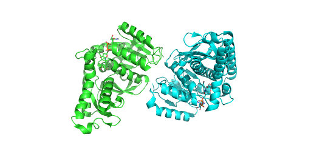
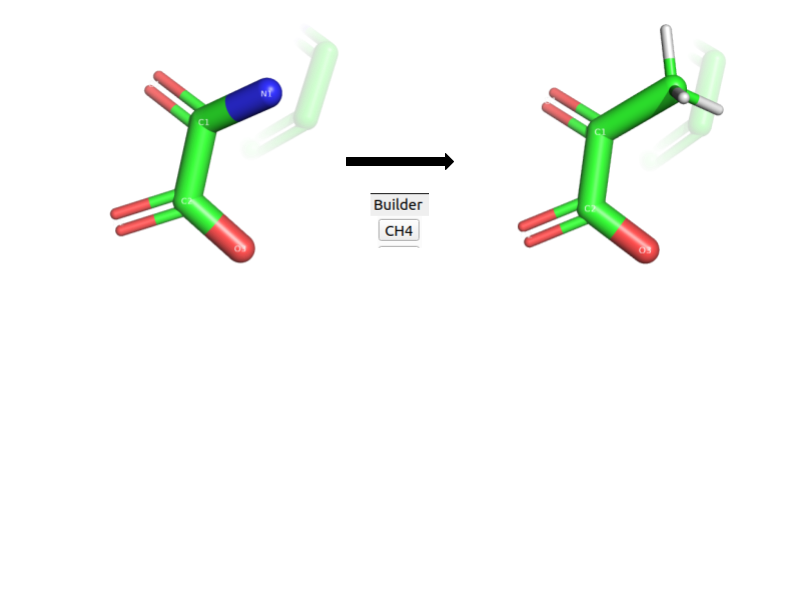
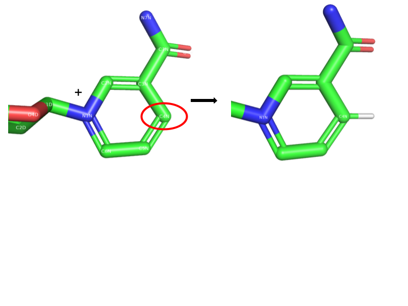
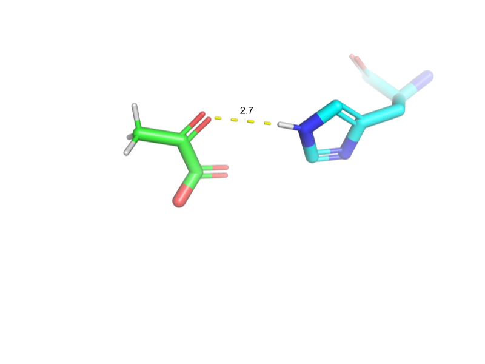
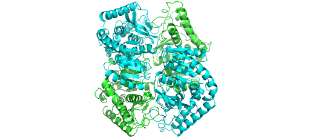

# Structural Modeling of L-Lactate Dehydrogenase

## Overview

This project explores the structural modeling and allosteric regulation of *L-Lactate Dehydrogenase* (LDH) from *Bacillus stearothermophilus* using structural bioinformatics approaches.

Using the PDB structure **1LDN** as a starting point, catalytic and regulatory complexes were modeled to investigate substrate interactions, NAD⁺ reduction, proton transfer, tetramer assembly, and FBP-mediated allosteric activation.

---

## Methods & Tools

- PyMOL
- PDB structural analysis
- Ligand modeling
- Structural editing and validation

---

## Example Figures

### LDH Dimer Structure


### Oxamate to Pyruvate Conversion


### NAD⁺ to NADH Conversion


### Catalytic Protonation by His193


### Tetramer Reconstruction and Allosteric Activation


---

## Repository Structure

```text
.
├── figures/          # Selected PyMOL visualizations
├── report/           # Final project report
└── README.md
```

---

## Notes

The complete project report, including methodology and structural analysis, is available in the `report/` directory.

---

## Authors

- Òscar Contreras Parejo
- Ainhoa López
- Martí Díez
- Said Gutierrez
